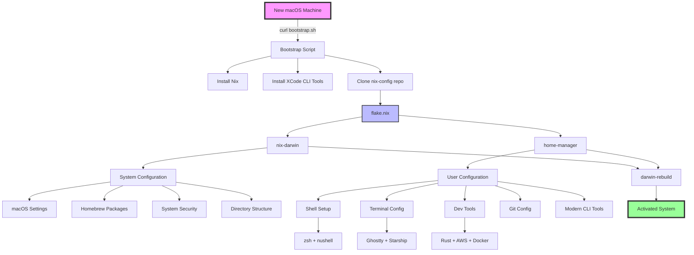

# VectorOpsAI Nix Configuration Architecture



## Configuration Flow

1. **Entry Point**: `bootstrap.sh` handles everything
2. **Nix Flake**: Central configuration in `flake.nix`
3. **Two Managers**:
   - `nix-darwin`: System-level macOS settings
   - `home-manager`: User-level applications and dotfiles
4. **Single Command**: `darwin-rebuild switch` applies everything

## Key Benefits

- 🔄 **Reproducible**: Exact same setup every time
- 📦 **Declarative**: Configuration as code
- 🚀 **Fast**: Parallel installation
- 🔒 **Atomic**: All-or-nothing updates
- ↩️ **Rollback**: Easy recovery from bad changes

## Files Overview

```
nix-config/
├── 🚀 bootstrap.sh          # One-liner setup script
├── ❄️  flake.nix            # Main configuration
├── 🔒 flake.lock           # Pinned versions
├── 📖 README.md            # Documentation
├── 🔄 migrate.sh           # Migration helper
└── modules/
    ├── 🍎 darwin.nix       # macOS + Homebrew
    ├── 🏠 home.nix         # User environment
    └── 📁 configs/         # App configurations
        ├── ghostty/        # Terminal settings
        └── nushell/        # Shell settings
```
